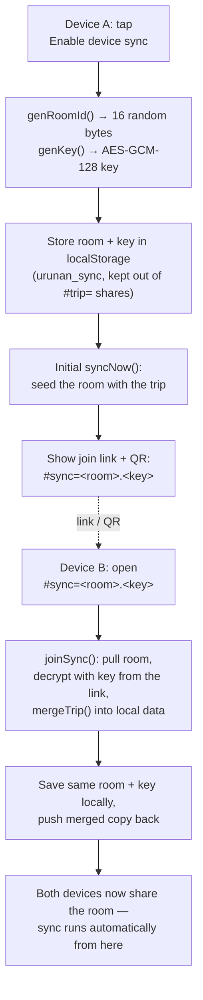
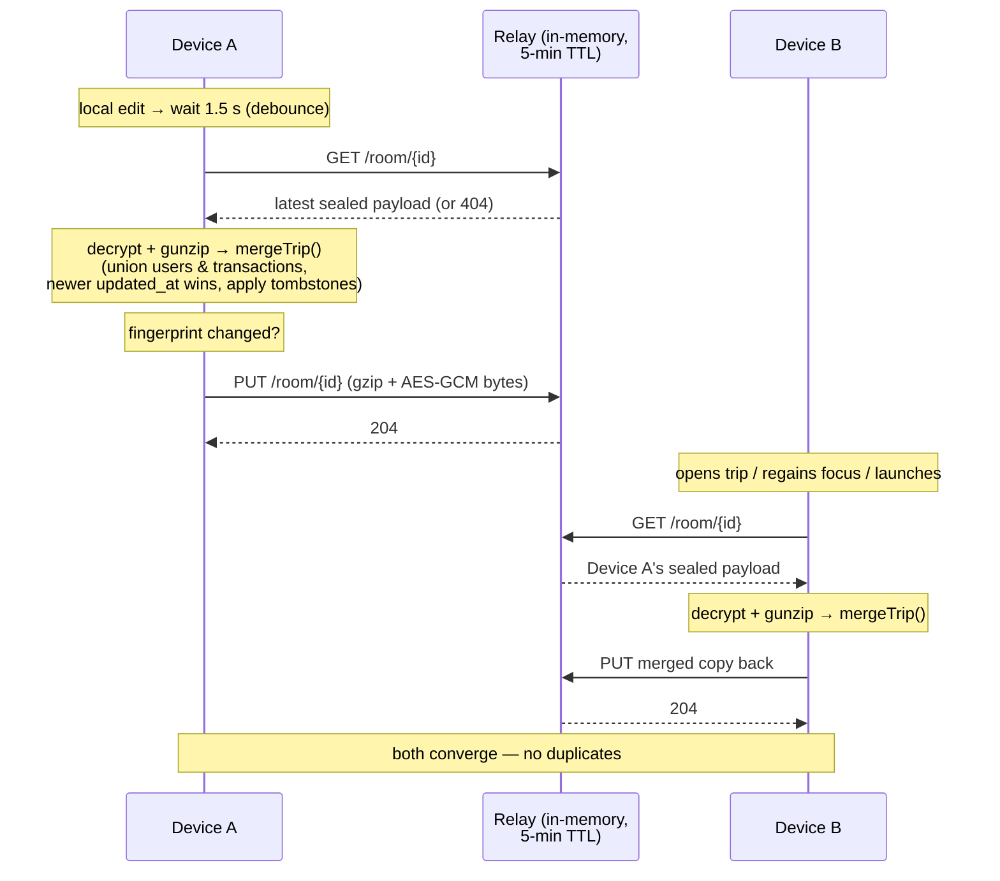

# Urunan 🧾
### _Split your bills_

Urunan is a bill-splitting app for trips and group activities: create a trip,
invite participants, record who paid what, and see who owes whom. Settle the
trip when everyone is square.

**Live app: https://rezpaditya.github.io/Urunan/**

The entire app is a single self-contained file — [`urunan.html`](urunan.html).
No server, no build step, no dependencies: Vue 3 and a QR code generator are
inlined, styling is hand-written CSS, and all data lives in your browser's
localStorage.

## Using the app

- **On your phone:** open the live URL in Safari/Chrome, then *Share → Add to
  Home Screen* to get a full-screen app icon. The app shows a one-time hint for
  this on the trips screen. On iOS the installed app starts with empty storage —
  bring your synced trips over with
  [email + passphrase recovery](#recovering-synced-trips-on-a-new-device).
- **Offline / no hosting:** download `urunan.html` and open it in any browser.
  Everything works from a `file://` URL too.

### Features

- Trips with multiple participants
- Transactions with custom payment splits (defaults to an even split,
  adjustable per person, validated against the total)
- Automatic debt settlement summary — minimal set of "who pays whom"
- Share a trip between devices with a **link or QR code** — no server
  involved: the trip data travels inside the URL fragment and merges
  automatically on import (repeat imports never duplicate data)
- **Optional live device sync** — enable it on a trip and changes flow
  both ways automatically across your devices via a tiny relay you host
  (see below). Off by default; the app is fully usable without it.
- **Email + passphrase recovery** — restore every synced trip on a brand-new
  device (e.g. a freshly installed home-screen app that started with empty
  storage) by entering your email and a recovery passphrase. See
  [Recovering synced trips](#recovering-synced-trips-on-a-new-device).
- Works offline; data persists in localStorage per device

## Optional: cross-device sync backend

Sync is **off unless you point the app at a relay** and is disabled entirely
when `SYNC_BASE_URL` (near the top of `urunan.html`) is left empty — forks work
untouched. The relay is a stateless rendezvous, not a database:

- It **stores nothing**. Payloads sit in memory for a few minutes so the other
  device can pick them up, then are evicted. Your devices' localStorage stays
  the sole home of your data.
- It **can't read your data**. Each payload is gzipped and AES-GCM encrypted in
  the browser; the key lives only in the sync link, so the relay only ever sees
  ciphertext.
- It's one standard-library Python script — see
  [`sync-server/`](sync-server/) for the code and deploy steps.

Deploy to Google Cloud Run (free tier, needs a GCP project with billing
enabled), then paste the service URL into `SYNC_BASE_URL`:

```bash
cd sync-server
gcloud services enable run.googleapis.com
gcloud run deploy urunan-sync --source . --region <your-region> --allow-unauthenticated
```

## How device sync works

Sync is **per trip** and **peer-to-peer through a dumb relay**. There is no
account, no server-side database, and no continuous connection — devices meet in
a named "room" on the relay, drop off an encrypted copy of the trip, and pick up
whatever the other device left. Everything below happens inside `urunan.html`
(search for the `Cloud sync (optional relay)` block); the relay only shuttles
opaque bytes.

### Starting sync — how a room is created and joined



- **How it starts:** enabling sync on a trip mints a random **room id** (16
  random bytes) and an **AES-GCM-128 key**, both kept in a separate
  `urunan_sync` localStorage entry so they never leak into `#trip=` link shares
  or the relayed payload. The join link is `…/#sync=<room>.<key>` — the key
  travels only in the link/QR, never to the relay.
- **How a device joins:** opening the `#sync=` link (or scanning its QR) makes
  the app pull the room, decrypt it with the key from the URL fragment, merge it
  locally, store the same room+key, and push its merged copy back. Repeat
  imports never duplicate data.

### What triggers a sync, and how long it takes

A sync is a single **pull → merge → push** cycle (`syncNow`). It fires on:

| Trigger | When |
|---|---|
| App launch | `syncAllOnStartup()` pulls every synced trip once, so a cold start shows fresh data |
| Opening a synced trip | `openTrip()` calls `syncNow` immediately |
| A local edit | `maybeSync()` — **debounced 1.5 s** after add/edit/delete of a transaction, member changes, or settling |
| Tab/app regains focus | `visibilitychange` re-syncs the open trip |
| Manual **🔄 Sync now** button | on demand |

Each cycle is a couple of short HTTPS requests — typically well under a second on
a normal connection. There is **no polling loop**: nothing runs on a fixed
timer, so an idle app makes no sync traffic. A re-entrancy guard means only one
cycle per trip runs at a time, and a push is skipped entirely when the local
state hasn't changed (fingerprint compare against `lastSynced`).

### The sync cycle — pull, merge, push



**Merging** (`mergeTrip`) is what makes two-way sync safe without a server
referee: users and transactions are unioned by id, an edited transaction wins by
its `updated_at` timestamp, and deletions carry **tombstones**
(`deleted_tx_ids`, `deleted_user_emails`) so a delete on one device is never
resurrected by an older copy from another.

### What the relay actually sees

Every payload is compressed and encrypted **in the browser** before it leaves
the device, so the relay only ever holds ciphertext:

```
sealed payload = [ gzip flag : 1 byte ] [ IV : 12 bytes ] [ AES-GCM ciphertext ]
                 trip JSON ──gzip──▶ bytes ──AES-GCM(key)──▶ ciphertext
```

The key never reaches the relay (it lives only in the `#sync=` link), so the
relay cannot read a trip even in principle. See
[`sync-server/server.py`](sync-server/server.py): rooms live in an in-memory
dict, get a **5-minute TTL**, and are capped at 128 KB per payload.

**Limitations:** the relay only holds the most recent push per room, in memory —
if it restarts or scales to zero the room empties, but no data is lost because
each device re-seeds it on the next sync. Deleting an entire **trip** is
local-only and does not propagate (deleting a single transaction does, via
tombstones).

### Recovering synced trips on a new device

Sync creds (the random room id + key) live in each device's `localStorage`. A
brand-new device therefore doesn't know them — most visibly when you **Add
Urunan to your Home Screen on iOS**, where the installed web app gets its own
storage partition separate from Safari and starts empty. The join link/QR is one
way back; **email + passphrase recovery** is the other.

- **Setting up:** the first time you enable sync you're asked for a one-time
  **recovery passphrase**. From it (plus your email) the app derives a private
  "inbox" — another room on the same relay — that holds an encrypted list of
  every synced trip's room + key. Active devices refresh it automatically.
- **Restoring:** on the new device, set up with the same email, tap **🔄 Restore
  synced trips**, and enter your email + passphrase. The app re-derives the
  inbox, pulls the manifest, and re-joins every trip.
- **Already had synced trips (upgrading)?** Trips synced before this feature
  existed have no inbox, and there is no server-side lookup from email alone, so
  they can't be restored by email until you set a passphrase. On a device that
  still has the trip, open its **Share** panel and tap **Set up recovery** to
  choose a passphrase and publish your synced trips to the inbox — then email +
  passphrase recovery works on your other devices.
- **Privacy:** the inbox room id *and* its encryption key are both derived from
  `email + passphrase` via PBKDF2. Email alone (which is public) can neither
  locate nor read anything — the passphrase is the secret, so end-to-end
  encryption is preserved. The passphrase can't be reset; keep it safe.
- **Same in-memory model:** the inbox is just another relayed room, so it lives
  only in relay memory and stays reachable only while one of your devices has
  pushed recently. Recovery works best right after opening the app on a device
  that still has the trips.

## Development

Edit `urunan.html`, open it in a browser, refresh. That's the whole loop.

## Deployment

Pushing a change to `urunan.html` on `main` triggers the
[`github-pages`](.github/workflows/github-pages.yml) workflow, which copies it
to the `gh-pages` branch as `index.html`; GitHub Pages publishes from there.
Manual alternative: commit the file to `gh-pages` yourself.

## Archived

The original implementation — a Vue 3 + Vite SPA with a FastAPI/SQLAlchemy
backend, Auth0 authentication, and Docker-based deployment — lives in
[`archived/`](archived/) for reference. It is no longer deployed or maintained.
